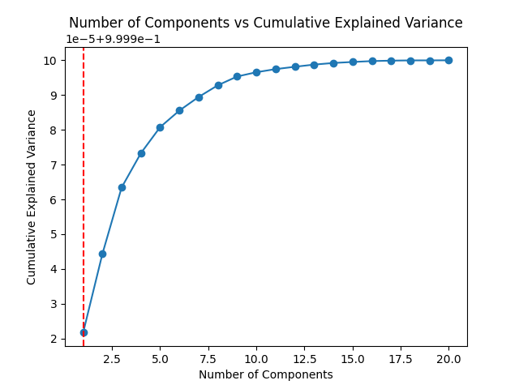

# **Comprehensive Report**

## **1. Exploratory Data Analysis and Preprocessing**

### **a. Dataset Overview**

- The Dataset, **`Hitters.csv`**, was loaded and examined.
- Initial Dataset shape: **`(263, 20)`**
- Displayed the first few rows of the dataset using **`df.head()`**.

### **b. Handling Missing Values**

- Checked for missing values using **`df.isna().sum()`**.
- Removed rows with missing values using **`df = df.dropna()`**.
- Reset index after dropping missing values: **`df = df.reset_index(drop=True)`**.

### **c. Column Mapping for Categorical Features**

- Mapped Categorical Features (**`League`**, **`Division`**, **`NewLeague`**) to numerical values.
- Displayed the mapping for each categorical column.

### **d. Data Statistics**

- Displayed general information about the dataset using **`df.info()`**.
- Described the statistical summary of the dataset using **`df.describe()`**.
- Computed the correlation matrix using **`df.corr()`**.

## **2. Principal Component Analysis (PCA)**

### **a. Standardization**

#### **Feature Standardization**

- **Separation of Features and Target Variable:**

  - We separated the features **`X`** and target variable **`y`** to prepare for the Principal Component Analysis (PCA) process.
- **Standardization of Features:**

  - Features were standardized to ensure a consistent scale across variables.
  - Standardized features: **`X_standardized = (X - X.mean()) / X.std()`**.
- **Why Standardize Features Before PCA?**

  - Standardizing features is crucial for PCA because it ensures that all variables contribute equally to the analysis.
  - PCA is sensitive to the scale of the variables, and standardization helps prevent dominance by variables with larger scales.
  - It facilitates a more accurate representation of the covariance structure and aids in identifying the principal components effectively.

#### **Target Variable Standardization (Not Performed)**

- We did not standardize the target variable **`y`** in this context.
- **Reason:**

  - Standardizing the target variable is unnecessary for PCA.
  - PCA focuses on capturing variance in the features, and the scale of the target variable does not impact this process.
  - Standardizing the target could distort the interpretability of the regression coefficients when interpreting the original feature space.
- **Summary:**

  - Standardizing features ensures a meaningful PCA outcome, while the target variable remains unstandardized to maintain interpretability in subsequent regression analyses.

### **b. Eigenvalue and Eigenvector Calculation**

- Calculated the covariance matrix **`covariance_matrix`** using **`np.cov(X_standardized, rowvar=False)`**.
- The covariance matrix provides insights into the relationships between different features by quantifying their joint variability.
- Obtained **`eigenvalues`** and **`eigenvectors`** using **`eigenvalues, eigenvectors = np.linalg.eig(covariance_matrix)`**.
- Eigenvalues represent the amount of variance captured by each principal component and Eigenvectors indicate the direction in which the data varies the most.
- Sorted **`eigenvalues`** and corresponding **`eigenvectors`** in descending order.
- The eigenvalues represent the variance explained by each principal component, and sorting helps prioritize the components with higher variance.
- Eigenvalues play a crucial role in PCA, as they quantify the amount of information (variance) retained in each principal component.
- Eigenvectors provide the direction of maximum variance, aiding in the interpretation of principal components.
- By examining these values, we gain insights into the intrinsic structure of the data and can determine the optimal number of principal components to retain for dimensionality reduction.

### **c. Explained Variance and Cumulative Explained Variance**

- Calculated Explained variance for each component.
- Explained variance represents the proportion of the total variance in the dataset that is captured by each individual principal component. It serves as a measure of how much information each component retains from the original data.
- Computed cumulative explained variance by summing up the explained variance values across all components.
- Cumulative explained variance provides insights into the total information retained as we consider an increasing number of principal components.
- Useful for determining the minimum number of components required to retain a significant amount of information.
- Determined the number of components explaining at least 90% of the variance.
- These metrics guide the decision-making process in selecting an appropriate number of principal components.

### **d. Number of Components vs Cumulative Explained Variance**

- Plotted the relationship between the number of components and explained variance.
- Identified the number of components for at least 90% variance (which is determined to be the stable number of components).

## **3. Model Training**

### **a. Train-Test Split**

- Set a random seed and split the dataset into training and testing sets.
- Fraction of data used for training: **`train_fraction = 0.8`**. Train and Test are 80/20 split.
- The train-test split is a critical step in model development, supporting the evaluation of model performance on unseen data. It helps validate the model's generalization capabilities, guards against over-fitting, and allows for reproducibility by setting a random seed.

### **b. Linear Regression Model**

#### **Model Functions Explanation:**

- **`fit_linear_regression` Function:**

  - **Parameters:**

    - **`x`**: Feature matrix.
    - **`y`**: Target variable.
    - **`lr`** (optional): Learning rate for gradient descent (default: 0.00001).
    - **`e`** (optional): Convergence threshold (default: 0.9).
  - **Working:**

    - Inserts a new column of ones (bias term) to the feature matrix.
    - Initializes weights with ones, matching the width of the feature matrix.
    - Utilizes gradient descent to iteratively update weights.
    - The loop continues until the norm of the gradient is below the convergence threshold.
    - Handles cases where the model diverges by printing a warning.
  - **Return:**

    - Returns the learned weights.
- **`predict` Function:**

  - **Parameters:**

    - **`w`**: Weights learned from the linear regression model.
    - **`x`**: Feature vector for prediction.
  - **Working:**

    - Calculates the predicted target variable **`y_pred`** using the learned weights.
    - The prediction involves multiplying feature values by corresponding weights and adding the bias term.
  - **Return:**

    - Returns the predicted target variable.
- **`MSE` Function:**

  - **Parameters:**

    - **`y`**: Actual target variable values.
    - **`y_pred`**: Predicted target variable values.
  - **Working:**

    - Computes the Mean Squared Error (MSE) between actual and predicted values.
    - MSE measures the average squared difference between predicted and actual values.
  - **Return:**

    - Returns the MSE value.
- **`MAE` Function:**

  - **Parameters:**

    - **`y_true`**: Actual target variable values.
    - **`y_pred`**: Predicted target variable values.
  - **Working:**

    - Calculates the Mean Absolute Error (MAE) between actual and predicted values.
    - MAE measures the average absolute difference between predicted and actual values.
  - **Return:**

    - Returns the MAE value.

#### **Model Working Explanation:**

- The linear regression model is trained using the gradient descent optimization algorithm.
- The **`fit_linear_regression`** function initializes weights, performs gradient descent, and iteratively updates weights until convergence.
- The **`predict`** function uses the learned weights to make predictions for new data points.
- MSE and MAE functions provide quantitative measures of the model's performance by calculating the mean squared and mean absolute errors, respectively.
- The model's success relies on finding optimal weights that minimize the difference between predicted and actual target variable values, as measured by MSE and MAE.

### **c. Model Evaluation with PCA**

#### **Model Evaluation Function Explanation:**

- **`fit_and_evaluate_pca_regression` Function:**

  - **Parameters:**

    - **`X_train`**: Feature matrix of the training set.
    - **`y_train`**: Target variable of the training set.
    - **`X_test`**: Feature matrix of the testing set.
    - **`y_test`**: Target variable of the testing set.
    - **`num_components`**: Number of principal components to consider.
  - **Working:**

    - Projects the original data onto the selected number of principal components using eigenvectors.
    - Applies the previously defined **`fit_linear_regression`** function to train a linear regression model on the transformed training data.
    - Makes predictions on the test set using the learned weights.
    - Calculates the Root Mean Squared Error (RMSE) as a performance metric.
  - **Return:**

    - Returns the calculated RMSE value.
- **Principal Component Analysis (PCA):**

  - Applied PCA to the training and testing sets with varying numbers of principal components.
  - The **`fit_and_evaluate_pca_regression`** function projects data onto the selected number of principal components, facilitating dimensionality reduction.
- **Linear Regression Model Training:**

  - Utilized the **`fit_linear_regression`** function within the evaluation function to train a linear regression model.
  - The model is trained on the transformed training data obtained through PCA.
- **Prediction and RMSE Calculation:**

  - Made predictions on the testing set using the trained model.
  - Calculated the Root Mean Squared Error (RMSE) to assess the model's predictive accuracy.
  - RMSE measures the average magnitude of the differences between predicted and actual values, providing an indication of the model's performance.
- **Iterative Evaluation over Component Numbers:**

  - The model evaluation process is repeated for a range of principal component numbers.
  - RMSE values are stored for each number of components, allowing for a comparative analysis.

#### **Model Evaluation Working Explanation:**

- The model evaluation procedure involves applying PCA for dimensionality reduction and training a linear regression model on the transformed data.
- The RMSE is calculated to quantify the accuracy of predictions.
- Iterating over different numbers of principal components provides insights into the impact of dimensionality on model performance, aiding in the selection of an optimal number of components.

## **4. Graphical Analysis**

### **a. Number of Components vs RMSE**

- **Plotting RMSE Values:**
  - The graph illustrates how the Root Mean Squared Error (RMSE) varies with different numbers of principal components.
  - Each point on the plot represents the RMSE value for a specific number of components, providing a visual representation of the trade-off between model complexity and accuracy.

- **Identification of Stable RMSE:**
  - The red dashed line highlights the stable RMSE point, where the error metric either reaches a minimum or starts stabilizing.
  - This point is crucial for determining the optimal number of components that strike a balance between model simplicity and predictive accuracy.

- **Graphical Interpretation:**
  - The plot assists in understanding how the addition of principal components influences the model's predictive performance.
  - As the number of components increases, the RMSE may initially decrease, but it eventually reaches a point where further components contribute marginally to predictive accuracy.

- **Practical Application:**
  - The graphical analysis aids in making informed decisions about the number of components to retain for efficient dimensionality reduction.
  - Selecting the stable RMSE point ensures a model configuration that balances accuracy and efficiency.

- **Further Considerations:**
  - Additional analysis could involve examining the behavior of other evaluation metrics or exploring the explained variance associated with each number of components.

- **Summary:**
  - The graphical analysis provides a clear visualization of how the RMSE changes with different numbers of principal components. Identifying the stable RMSE point guides the selection of an optimal model configuration for effective prediction while avoiding unnecessary complexity.

## **5. Testing the Most Efficient Model**

### **a. Optimal Number of Components**

- **Chosen Optimal Number of Components:**
  - Determined the optimal number of components based on the stable RMSE point identified in the graphical analysis.
  - The optimal number of components is calculated as **`optimal_num_components = min_rmse_index + 1`**.

### **b. Model Prediction**

- **Projection onto Optimal Components:**
  - Projected the original data onto the selected optimal number of principal components.
  - This step involves transforming both the training and testing sets using the eigenvectors associated with the chosen components.

- **Linear Regression Model Fitting:**
  - Fitted a linear regression model using gradient descent on the transformed training data.
  - The model is trained to capture the underlying patterns in the reduced-dimensional space.

- **Prediction for a Specific Data Point:**
  - Selected a specific data point **`specific_point`** from the testing set for prediction.

- **Making Predictions:**
  - Utilized the `predict` function to make predictions for the chosen data point.
  - The predicted y value is displayed: **`169.08245822253235`**.

### **Additional Points:**

- **Significance of Optimal Number:**
  - The optimal number of components represents a compromise between model simplicity and predictive accuracy.
  - It ensures that the model captures essential information while avoiding unnecessary complexity.

- **Interpretation of Predicted Y Value:**
  - The predicted y value is the model's estimate of the target variable for the specific data point.
  - Its interpretation depends on the context of the dataset and the units of the target variable.

- **Further Analysis:**
  - Additional analysis could involve assessing the model's performance on a broader set of test data or using different evaluation metrics.

- **Conclusion:**
  - The testing of the most efficient model provides insights into its predictive capabilities. The predicted y value serves as a specific instance demonstrating the model's estimation for a given input.

## **6. Conclusion and Analysis**

### **a. Interpretation of the Graph**

- Analyzed the number of components vs RMSE graph to understand the trade-off between model complexity and accuracy.
- Identified the optimal number of components marked by the stable RMSE point.

### **b. Significance of Selecting an Appropriate Number of Components**

- Emphasized the importance of finding the right balance between model simplicity and predictive accuracy.
- Discussed the significance of avoiding under-fitting and over-fitting.

### **c. Analysis of the Predicted Value (y_pred)**

- Highlighted the importance of analyzing the predicted value in the context of the specific application.

### **d. Accuracy Assessment**

- Calculated Mean Absolute Error (MAE) for a comprehensive evaluation.
- Displayed the MAE value: **`236.30859972742817`**.
